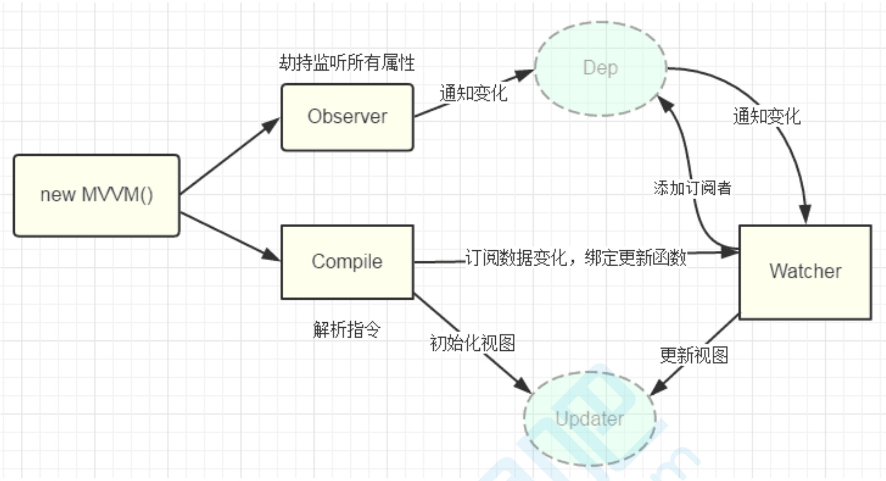

# 实现一个简单的 Vue （MVVM）

## MVVM 框架三要素

- 数据响应式
- 模板引擎
- 渲染

### 数据响应式

- `Obejct.defineProperty()` (2.0)
- `Proxy` (3.0)

### 模板引擎：提供描述视图的模板语法

- 插值表达式：`{{}}`
- 指令： `v-bind`,`v-on`,`v-model`,`v-for`

### 渲染

- 模板 => vdom => dom

## 原理分析

1. `new Vue()`首先执行初始化，对`data`执行响应化处理，这个过程发生在`observe`中
2. 同时对模板进行编译，找到动态绑定的数据，从`data`中获取并初始化视图，这个过程发生在`complie`中
3. 同时定义一个更新函数和`Watcher`，将来对应数据发生变化时`Watcher`会调用更新函数
4. 由于`data`中的某个`key`可能出现多次，所以每个`key`都需要一个管家`Dep`来管理多个`Watcher`
5. 如果`data`中的数据发生变化，先寻找对应的`Dep`，然后同志所有的`Watcher`执行更新函数
   
